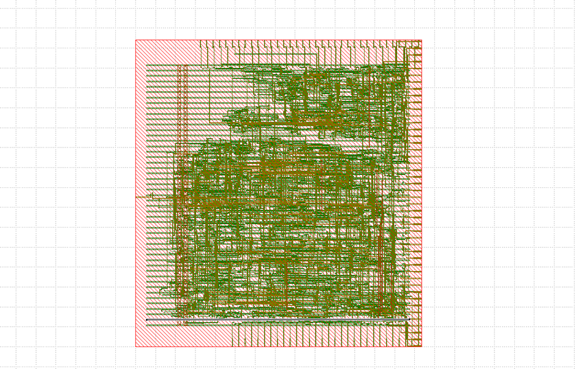
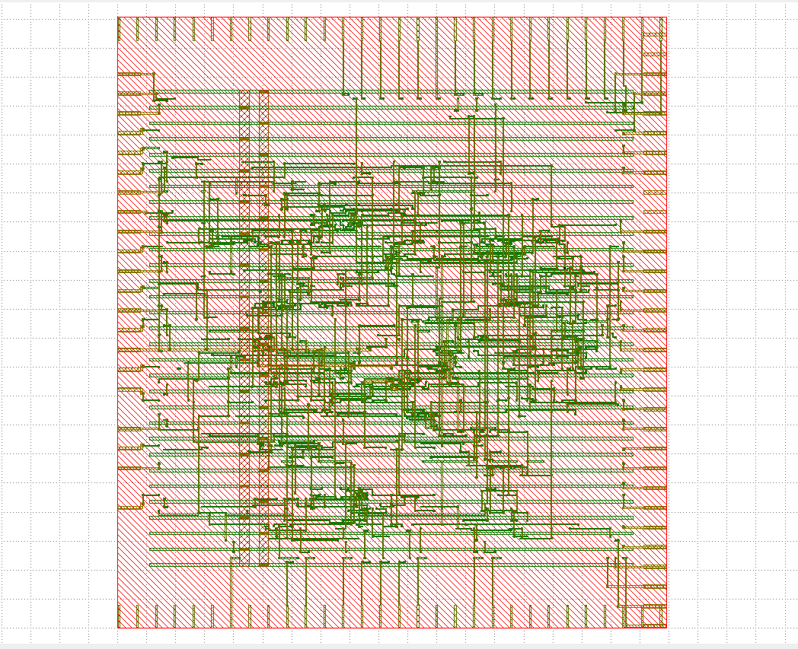
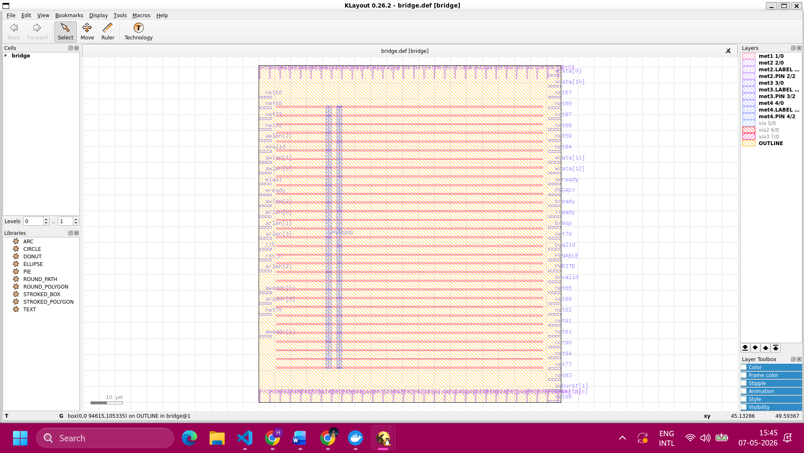

# AXI-Lite to APB Bridge ASIC Implementation and Pipeline Optimization

| Baseline                                         | Pipelined                                          |
| ------------------------------------------------ | -------------------------------------------------- |
|  |  |

---
## Overview

This project explores the complete RTL-to-GDSII ASIC implementation flow for an AXI-Lite to APB bridge using the OpenLane/OpenROAD toolchain and the Sky130 PDK.

Two architectures were implemented and analyzed:

1. Baseline AXI-Lite to APB Bridge
2. Pipelined AXI-Lite to APB Bridge

The objective of this work was to:

* Implement a complete open-source ASIC backend flow
* Perform synthesis, floorplanning, placement, CTS, routing, STA, and signoff verification
* Analyze backend QoR metrics under aggressive timing constraints
* Evaluate the impact of pipelining on timing closure and maximum operating frequency
* Compare physical design characteristics between baseline and optimized architectures

---

# Design Details

## Top Module

`bridge.v`

## Supported Protocols

* AXI-Lite
* APB

## Design Features

* FSM-based transaction control
* Read/Write transaction handling
* Burst transaction support
* Synthesizable RTL implementation
* Timing-aware pipelined architecture

---

# Toolchain

| Tool       | Purpose                              |
| ---------- | ------------------------------------ |
| OpenLane   | Automated RTL-to-GDSII flow          |
| OpenROAD   | Physical design and STA              |
| Yosys      | RTL synthesis                        |
| Verilator  | RTL linting                          |
| Magic      | DRC and layout visualization         |
| KLayout    | GDSII visualization                  |
| Sky130 PDK | Open-source 130nm technology library |

---

# RTL-to-GDSII Flow

Both implementations successfully completed:

* RTL Linting
* Logic Synthesis
* Floorplanning
* Global Placement
* Detailed Placement
* Clock Tree Synthesis (CTS)
* Global Routing
* Detailed Routing
* Static Timing Analysis (STA)
* Design Rule Checking (DRC)
* GDSII Generation

---

# Architectural Optimization

## Baseline Architecture

The original bridge implementation used direct AXI-to-APB combinational transaction handling with FSM-based protocol control.

Under aggressive timing constraints, the baseline design exhibited significant setup timing violations caused by long combinational critical paths.

---

## Pipelined Architecture

The optimized architecture introduced a dedicated AXI-side pipeline stage.

Pipeline registers were inserted for:

* AXI address signals
* Valid control signals
* Burst control signals
* Write datapath signals

This reduced combinational logic depth and improved timing scalability.

---

# QoR Comparison

## Timing Comparison @ 5 ns Clock Constraint (200 MHz)

| Metric         | Baseline  | Pipelined |
| -------------- | --------- | --------- |
| WNS            | -0.538 ns | -0.155 ns |
| TNS            | -6.516 ns | -0.707 ns |
| Estimated Fmax | ~180 MHz  | ~194 MHz  |

---

## Physical Design Comparison

| Metric                    | Baseline  | Pipelined |
| ------------------------- | --------- | --------- |
| Synthesized Area          | ~8765 µm² | ~2444 µm² |
| Post-DFF Area             | ~4973 µm² | ~1051 µm² |
| Final Cell Count          | ~721      | ~215      |
| DRC Status                | Passed ✅  | Passed ✅  |
| Standard Cell Utilization | ~41.8%    | ~41.8%    |

---

# Key Observations

## Timing Improvement

Pipeline insertion significantly reduced setup timing violations:

```text
WNS Improvement:
-0.538 ns → -0.155 ns
```

This demonstrates the effectiveness of pipelining in shortening critical combinational paths.

---

## Frequency Scaling

The pipelined implementation improved estimated maximum operating frequency:

```text
Baseline   : ~180 MHz
Pipelined  : ~194 MHz
```

This improvement was achieved while maintaining successful routing convergence and DRC-clean layout generation.

---

## Backend QoR Behavior

The project demonstrated how microarchitectural RTL changes directly impact:

* Timing closure behavior
* Critical path delay
* Physical design convergence
* Routing complexity
* Area utilization
* Placement behavior

---

# GDSII Comparison

## Baseline GDSII Layout


---

## Pipelined GDSII Layout


---

# Floorplan Comparison

| Baseline                                             | Pipelined                                              |
| ---------------------------------------------------- | ------------------------------------------------------ |
|  |  |

---

# Routed Layout Comparison

| Baseline                                         | Pipelined                                          |
| ------------------------------------------------ | -------------------------------------------------- |
|  |  |

---

# Repository Structure

```text
asic_projects/
│
├── axi_apb_openlane/                 # Baseline implementation
├── axi_apb_pipelined_openlane/       # Pipelined implementation
├── images/                           # Shared screenshots
└── README.md
```

---

# Key Learning Outcomes

This project provided hands-on experience with:

* ASIC backend implementation flow
* Timing-driven RTL optimization
* Pipeline-aware microarchitecture refinement
* Physical design QoR analysis
* Timing closure methodology
* Open-source silicon implementation tools

---

# References

* OpenLane
* OpenROAD
* SkyWater Sky130 PDK
* Yosys Open Synthesis Suite
* Magic VLSI
* KLayout

---

## Author

Harjas Kaur

ASIC RTL-to-GDSII Physical Design and Timing Optimization Project
