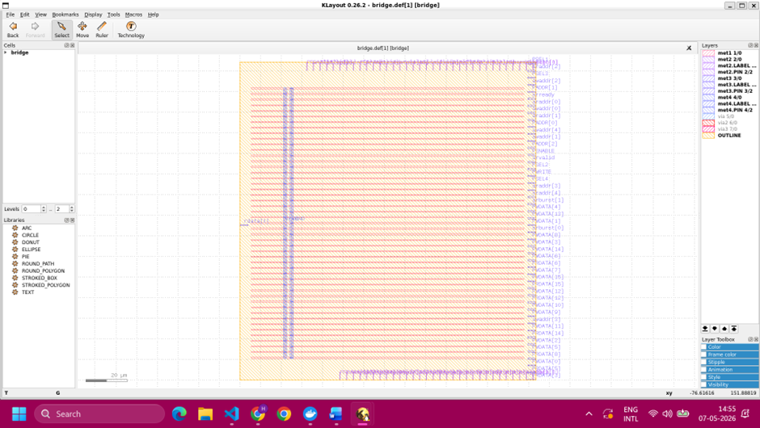

# AXI-Lite to APB Bridge — RTL-to-GDSII Physical Design Flow

## Overview

This project implements a complete RTL-to-GDSII ASIC design flow for an AXI-Lite to APB bridge using the open-source OpenLane/OpenROAD toolchain and the Sky130 PDK.

The objective of this project was to:

* Establish a functional ASIC implementation flow
* Perform synthesis, floorplanning, placement, clock-tree synthesis, routing, STA, and DRC verification
* Analyze physical design metrics such as congestion, utilization, timing closure, and routing quality
* Create a baseline implementation for future architectural optimization studies

---

# Design Details

## Top Module

`bridge.v`

## Protocols

* AXI-Lite
* APB

## Design Features

* Read/Write transaction handling
* FSM-based protocol control
* Burst transaction support
* Internal buffering and data handling
* Synthesizable RTL architecture

---

# Toolchain

| Tool       | Purpose                              |
| ---------- | ------------------------------------ |
| OpenLane   | Automated RTL-to-GDSII flow          |
| OpenROAD   | Physical design and STA              |
| Yosys      | RTL synthesis                        |
| Verilator  | RTL linting                          |
| Magic      | DRC and layout visualization         |
| KLayout    | GDSII visualization                  |
| Sky130 PDK | Open-source 130nm technology library |

---

# RTL-to-GDSII Flow

The following stages were completed successfully:

* RTL Linting
* Logic Synthesis
* Floorplanning
* Global Placement
* Detailed Placement
* Clock Tree Synthesis (CTS)
* Global Routing
* Detailed Routing
* Static Timing Analysis (STA)
* Design Rule Checking (DRC)
* GDSII Generation

---

# Physical Design Flow

## RTL Synthesis

The RTL was synthesized using Yosys and mapped to the Sky130 standard-cell library.

### Synthesis Report

* Synthesized Area: ~8765 µm²
* Post-DFF Area: ~4973 µm²
* Cell Count: ~1403
* Final Cell Count: ~721

---

# Timing Analysis

The design successfully achieved timing closure.

## Timing Metrics

* Worst Negative Slack (WNS): 0 ns
* Total Negative Slack (TNS): 0 ns

This indicates that the design met all setup timing constraints.

---

# Routing and Congestion Analysis

Global and detailed routing completed successfully.

## Routing Results

* Global Routing Overflow: 0
* Final Placement Overflow: ~0.098
* DRC Status: Passed 

The implementation achieved a fully routable and DRC-clean layout.

---

# Layout Screenshots

## Floorplan


---


## Routed Layout



---

## Final GDSII Layout


---

# Physical Design Observations

## Congestion Behavior

The design exhibited low routing congestion and successfully converged without routing overflow.

## Timing Closure

The backend flow achieved clean timing closure with zero setup violations across analyzed corners.

## Area Utilization

The synthesized bridge occupied a compact silicon footprint suitable for lightweight SoC interconnect applications.

---

---

# Performance Characterization

To evaluate the timing performance of the baseline architecture, the design was synthesized and implemented under progressively tighter clock constraints using OpenLane/OpenROAD.

## Clock Constraint Analysis

The baseline implementation was tested at a target clock period of:

- Clock Period: 5 ns
- Target Frequency: 200 MHz

The resulting timing metrics were:

| Metric | Value |
|---|---|
| Worst Negative Slack (WNS) | -0.538 ns |
| Total Negative Slack (TNS) | -6.516 ns |

The negative setup slack indicates that the baseline architecture failed timing closure at 200 MHz.

---

## Estimated Maximum Frequency

The critical path delay can be approximated as:

```text
Critical Path Delay ≈ Clock Period + |WNS|
                    ≈ 5 ns + 0.538 ns
                    ≈ 5.538 ns
        Fmax ≈ 1 / 5.538 ns ≈ 180 MHz
---

# Repository Structure

```text
axi_apb_openlane/
│
├── src/                  # RTL source files
├── runs/                 # OpenLane run outputs
├── images/               # Layout screenshots
├── config.json           # OpenLane configuration
└── README.md
```

---

# Key Learning Outcomes

This project provided hands-on experience with:

* ASIC backend implementation flow
* Standard-cell based digital design
* Physical design optimization
* Timing closure methodology
* Routing and congestion analysis
* Open-source silicon design tools

---

# References

* OpenLane
* OpenROAD
* SkyWater Sky130 PDK
* Yosys Open Synthesis Suite
* Magic VLSI
* KLayout

---

## Author

Harjas Kaur

RTL-to-GDSII ASIC Implementation Project
