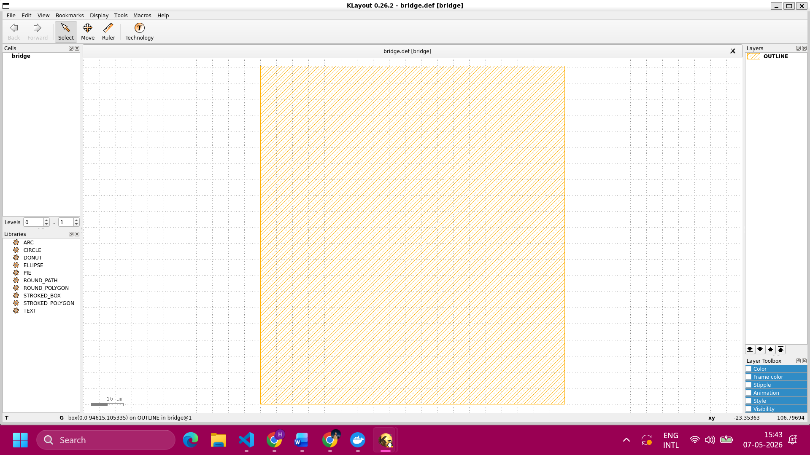
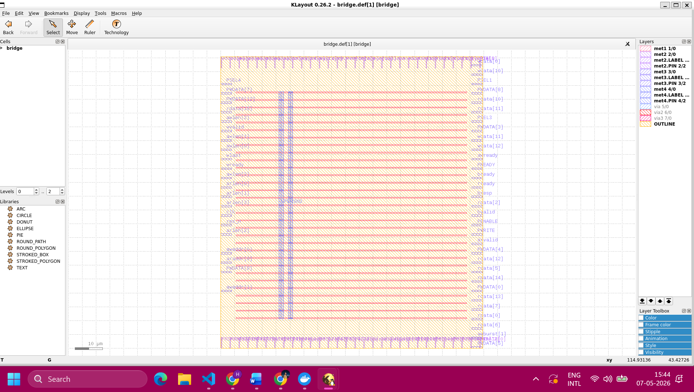

# Pipelined AXI-Lite to APB Bridge — RTL-to-GDSII Physical Design Flow

## Overview

This project implements a pipelined AXI-Lite to APB bridge through a complete RTL-to-GDSII ASIC flow using the OpenLane/OpenROAD toolchain and the Sky130 PDK.

The pipelined architecture was developed as an optimization over the baseline bridge implementation to improve timing behavior and maximum operating frequency under aggressive clock constraints.

The objective of this project was to:

* Implement a pipelined AXI-lite to APB bridge microarchitecture
* Evaluate the impact of pipeline insertion on ASIC backend QoR metrics
* Analyze timing closure behavior under high-frequency constraints
* Compare baseline and pipelined implementations using physical design metrics
* Perform full RTL-to-GDSII implementation using open-source ASIC tools

---

# Design Details

## Top Module

`bridge.v`

## Protocols

* AXI-Lite
* APB

## Design Features

* Pipelined AXI request capture stage
* FSM-based transaction control
* Read/Write transaction support
* Burst transaction handling
* Timing-optimized datapath architecture
* Synthesizable RTL implementation

---

# Pipelining Strategy

The optimization introduced a dedicated AXI-side pipeline stage to reduce combinational path depth between AXI request handling logic and APB transaction generation.

## Pipeline Modifications

Pipeline registers were inserted for:

* AXI address signals
* AXI valid signals
* Burst control signals
* Write data path signals

This reduced critical-path combinational depth and improved backend timing characteristics.

---

# Toolchain

| Tool       | Purpose                              |
| ---------- | ------------------------------------ |
| OpenLane   | Automated RTL-to-GDSII flow          |
| OpenROAD   | Physical design and STA              |
| Yosys      | RTL synthesis                        |
| Verilator  | RTL linting                          |
| Magic      | DRC and layout visualization         |
| KLayout    | GDSII visualization                  |
| Sky130 PDK | Open-source 130nm technology library |

---

# RTL-to-GDSII Flow

The following implementation stages were completed successfully:

* RTL Linting
* Logic Synthesis
* Floorplanning
* Global Placement
* Detailed Placement
* Clock Tree Synthesis (CTS)
* Global Routing
* Detailed Routing
* Static Timing Analysis (STA)
* Design Rule Checking (DRC)
* GDSII Generation

---

# Physical Design Flow

## RTL Synthesis

The pipelined RTL was synthesized using Yosys and mapped to the Sky130 standard-cell library.

### Synthesis Report

* Synthesized Area: ~2444 µm²
* Post-DFF Area: ~1051 µm²
* Final Cell Count: ~215
* Post-DFF Cell Count: ~256

---

# Timing Analysis

The design was evaluated under aggressive clock constraints to analyze timing scalability.

## Timing Metrics

| Metric                     | Value     |
| -------------------------- | --------- |
| Worst Negative Slack (WNS) | -0.155 ns |
| Total Negative Slack (TNS) | -0.707 ns |

The pipelined implementation significantly improved timing behavior compared to the baseline implementation.

---

# Routing and Congestion Analysis

Global and detailed routing completed successfully.

## Routing Results

* DRC Status: Passed ✅
* Standard Cell Utilization: ~41.8%

The implementation achieved a fully routable and DRC-clean physical layout.

---

# Performance Characterization

To evaluate timing scalability, the pipelined bridge was implemented using aggressive clock constraints.

## Clock Constraint Analysis

The pipelined implementation was evaluated at:

* Clock Period: 5 ns
* Target Frequency: 200 MHz

The resulting timing metrics were:

| Metric                     | Value     |
| -------------------------- | --------- |
| Worst Negative Slack (WNS) | -0.155 ns |
| Total Negative Slack (TNS) | -0.707 ns |

Compared to the baseline architecture:

| Metric | Baseline  | Pipelined |
| ------ | --------- | --------- |
| WNS    | -0.538 ns | -0.155 ns |
| TNS    | -6.516 ns | -0.707 ns |

The pipeline optimization substantially reduced setup timing violations and improved achievable operating frequency.

---

## Estimated Maximum Frequency

The critical path delay can be approximated as:

```text
Critical Path Delay ≈ Clock Period + |WNS|
                    ≈ 5 ns + 0.155 ns
                    ≈ 5.155 ns
```

Thus, the estimated maximum operating frequency becomes:

```text
Fmax ≈ 1 / 5.155 ns ≈ 194 MHz
```

Compared to the baseline implementation:

| Architecture | Estimated Fmax |
| ------------ | -------------- |
| Baseline     | ~180 MHz       |
| Pipelined    | ~194 MHz       |

---

# Layout Screenshots

## Floorplan



---

## Placement



---

## Routed Layout


---

## Final GDSII Layout


---

# Physical Design Observations

## Timing Improvement

Pipeline insertion significantly reduced setup timing violations and shortened critical combinational paths.

## Area Impact

The pipelined implementation achieved improved timing behavior while maintaining a compact physical footprint.

## Backend QoR Behavior

The optimized implementation converged successfully through routing and signoff stages while remaining DRC clean.

---

# Repository Structure

```text
axi_apb_pipelined_openlane/
│
├── src/                  # RTL source files
├── runs/                 # OpenLane run outputs
├── images/               # Layout screenshots
├── config.json           # OpenLane configuration
└── README.md
```

## Author

Harjas Kaur

Pipelined RTL-to-GDSII ASIC Optimization Project
